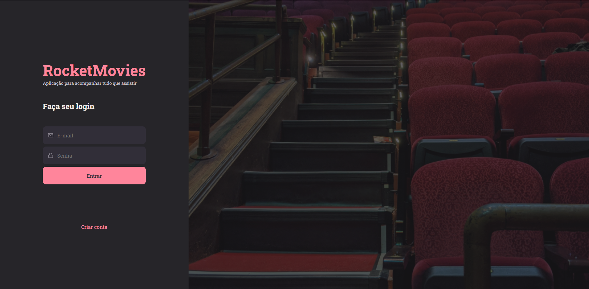
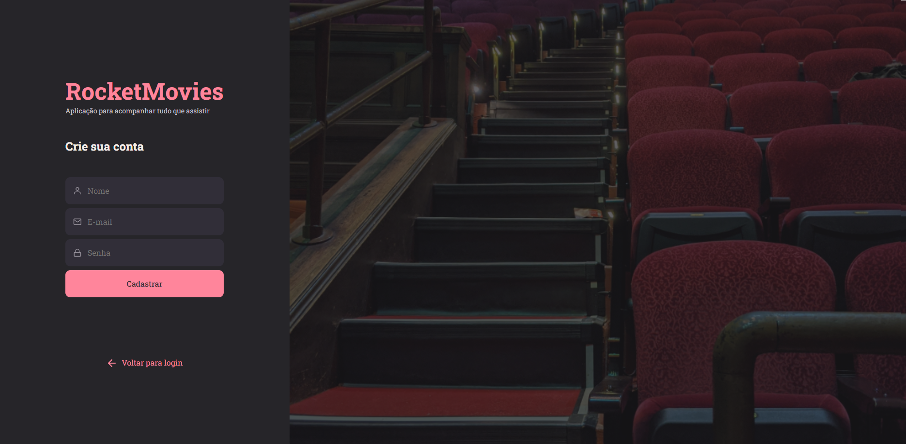
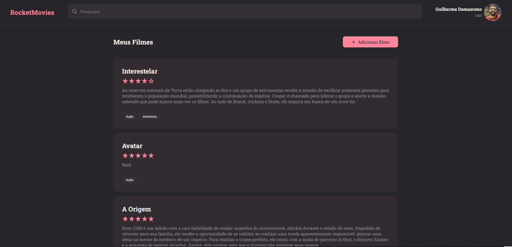
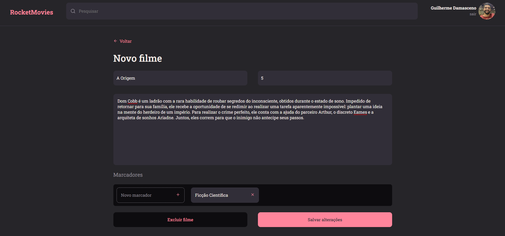
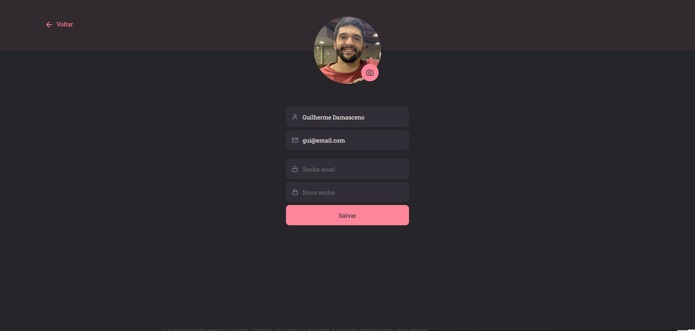
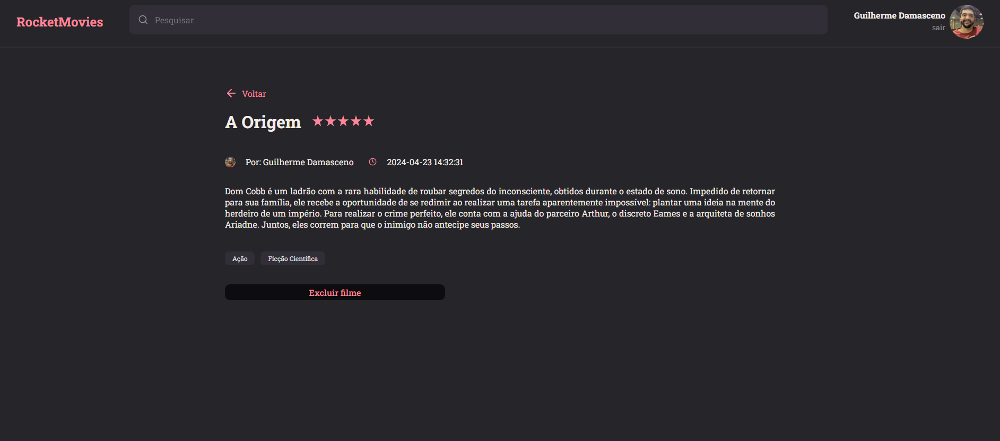

<h1 align="center"> RocketMovies </h1>

  <a href="#-tecnologias">Tecnologias</a>&nbsp;&nbsp;&nbsp;|&nbsp;&nbsp;&nbsp;
  <a href="#-layout">Layout</a>&nbsp;&nbsp;&nbsp;|&nbsp;&nbsp;&nbsp;

  Projeto de front end usando React. Aplicação para acompanhar todas os filmes que assistiu. No site é possível se cadastrar e adicionar o filme e em cada um deles colocar título, rating(nota), descrição e tags.
  Também é possível editar o perfil cadastrado e se necessário excluir um filme.

 
 

## 🚀 Tecnologias

Esse projeto foi desenvolvido com as seguintes tecnologias:

- ViteJS;
- JavaScript;
- ReactJS.

 
 

## 🔖 Layout
### Página de SingIn:

##
### Página de SingUp:

##
### Página de Home:

##
### Página de Novos Filmes:

##
### Página de Perfil:

##
### Página de Detalhes dos filmes:

## 
  

    Desenvolvido por: Guilherme Damasceno
  

